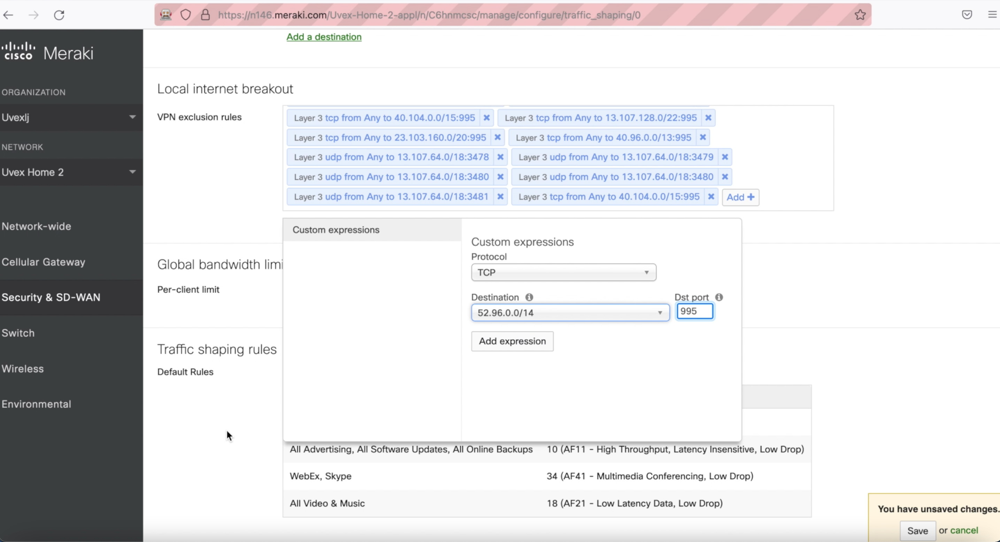

# Selenium Automation: Adding Cisco Meraki VPN exclusion rules

In the sample, you can see how we automatically add (from the list) VPN exclusion rules after running the script.

[Selenium](https://www.selenium.dev/) is an open-source tool that automates web browsers. It provides a single interface that lets testers automate user actions using multiple programming languages such as Ruby, Java, NodeJS, PHP, Perl, Python, and C#. But what if we try to automate some tasks that we can do only by using Web GUI interfaces/Dashboard?

### Requirements
You can deploy app using [Python](https://www.python.org/downloads/)

Download the latest Firefox driver [here](https://github.com/mozilla/geckodriver/releases/tag/v0.30.0)
Add Firefox driver in `/usr/local/bin/geckodriver` or edit path in `fillLocalInternetBreakout.py` [file](fillLocalInternetBreakout.py#L28)

### Clone and open project

```
git clone https://github.com/oborys/Selenium_automation_Adding_Cisco_Meraki_VPN_exclusion_rules.git
cd Selenium_automation_Adding_Cisco_Meraki_VPN_exclusion_rules
```

Open files `cred` and paste your variable that you use to access the Cisco Meraki dashboard `email`, `dashboardPass`, and 'url_sd_wan_and_traffic_rules' as URL for access SD-WAN and Traffic rules setting.



**For Windows:**

<details><summary>CLICK ME</summary>
<p>

Install pip

Pip (Python Package Installer), the official documentation for [pip](https://pip.pypa.io/en/stable/installation/).

Usually Python3 comes with pip preinstalled. If you get an error "pip command not found", use the following command to install pip:

Download [get-pip.py](https://pip.pypa.io/en/stable/installation/), make sure you're saving the file to Desktop

In your Command Prompt, navigate to Desktop.
```
cd Desktop
```
Execute get-pip.py
```
python get-pip.py
```
Now pip should work system-wide.

virtualenv

In your Command Prompt, enter:
```
pip install virtualenv
```
Launch virtualenv

In your Command Prompt navigate to your project:
```
cd Meraki_Network_Objects_automation
```
Within your project:
```
virtualenv env
```
Activate your virtualenv:

on Windows, virtualenv creates a batch file
```
\env\Scripts\activate.bat
```
to activate virtualenv on Windows, activate script is in the Scripts folder :

\path\to\env\Scripts\activate

Example:
```
C:\Users\'Username'\venv\Scripts\activate.bat
```
Another way to install pip

Save the "ez_setup.py" file to your desktop form https://bootstrap.pypa.io/ez_setup.py

In your Command Prompt navigate to Desktop:
```
cd Desktop
```
Execute ez_setup.py:
```
python ez_setup.py
```
install pip:
```
easy_install pip
```
Install dependencies
```
pip install -r requirements.txt
```
Run the app
```
set FLASK_APP=hello
flask run
```
</p>
</details>

```
python3 -m venv venv
```

Activate your venv

```
source venv/bin/activate
```

Install dependencies
```
pip install -r requirements.txt
```

```
export FLASK_APP=meraki_automation.py
```
Run the app
```
python fillLocalInternetBreakout.py 
```
